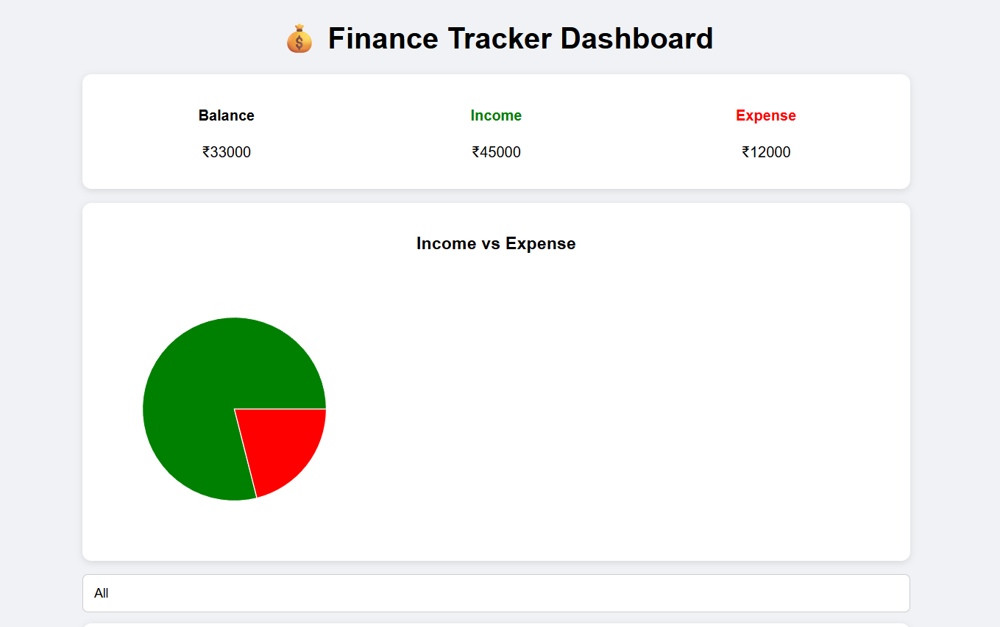
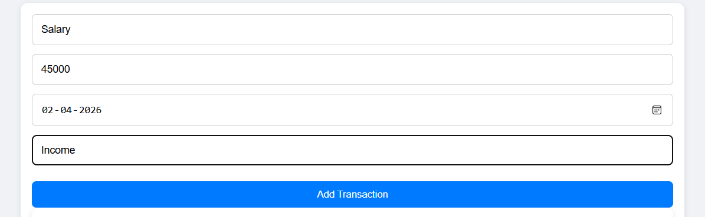
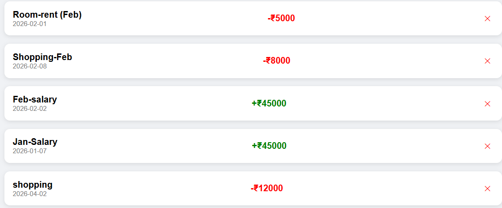

# 💰 Finance Dashboard

A modern finance dashboard built using React that helps users track income and expenses, manage transactions, and visualize financial data with charts.

---

## 🚀 Features

- ➕ Add and delete transactions  
- 📊 View total balance, income, and expenses  
- 🔍 Filter transactions (All / Income / Expense)  
- 📅 Add and display transaction dates  
- 📈 Visualize data using charts (Income vs Expense)  
- 💾 Persistent data storage using localStorage  

---

## 🛠️ Tech Stack

- React.js  
- CSS (Custom Styling)  
- Recharts (for charts)  
- LocalStorage  

---

## 📸 Screenshots

---

## ⚙️ Installation & Setup

Follow these steps to run the project locally:

### 1. Clone the repository
git clone https://github.com/Sacchu-1206/finance-dashboard.git

### 2. Navigate to project folder
cd finance-dashboard

### 3. Install dependencies
npm install

### 4. Run the development server
npm run dev